**Problem** 1a:

$$X|Y = - 1\sim\mathcal{N}\left( \mu_{-},I \right)$$

$$X|Y = 1\sim\mathcal{N}\left( \mu_{+},I \right)$$

Given the data, ML estimate $\mu_{+},\mu_{-}$

{width="3.0511811023622046in"
height="3.1102362204724407in"}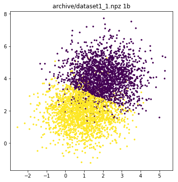{width="3.0551181102362204in"
height="3.1102362204724407in"}

{width="3.0511811023622046in"
height="3.1102362204724407in"}

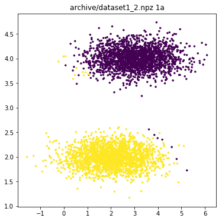{width="3.125984251968504in"
height="3.1102362204724407in"}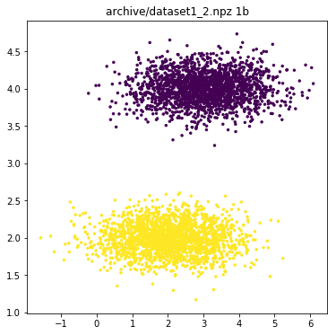{width="3.125984251968504in"
height="3.1102362204724407in"}

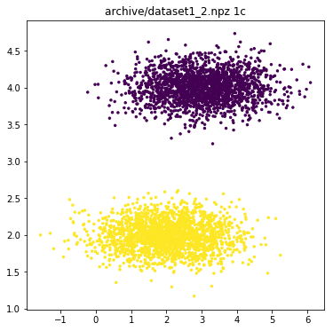{width="3.125984251968504in"
height="3.1102362204724407in"}

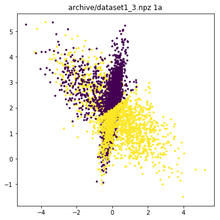{width="3.122047244094488in"
height="3.1102362204724407in"}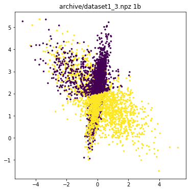{width="3.122047244094488in"
height="3.1102362204724407in"}

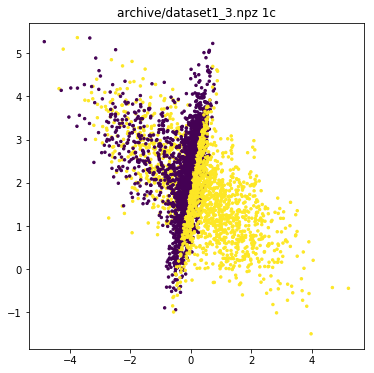{width="3.122047244094488in"
height="3.1102362204724407in"}

| Dataset  | 1a     | 1b     | 1c     |
|----------|--------|--------|--------|
| Dataset1 | 0.874  | 0.8755 | 0.8755 |
| Dataset2 | 0.9915 | 1.0    | 1.0    |
| Dataset3 | 0.503  | 0.505  | 0.527  |

For dataset1, the data is mostly separated to give accuracy of 0.87.
There is not much increase in the accuracy between 'a' and 'b' or 'c'.
because the separation between two variables $\mu_{+},\mu_{-}$ is
sufficient for the data to be well separated.

For dataset2, the data is well separated, and all the three algorithms
classify the data perfectly. Again, there is not much increase in
accuracy between 'a' and 'b' or 'c'.

For dataset3, the data is not separated, and the complexity of the
algorithm plays key role in classifying the data. You can see the
significant increase in the accuracy between 'b' and 'c'. since, c is
more complex algorithm compared to b.

**Problem** 2:

{width="3.1181102362204722in"
height="3.106299212598425in"}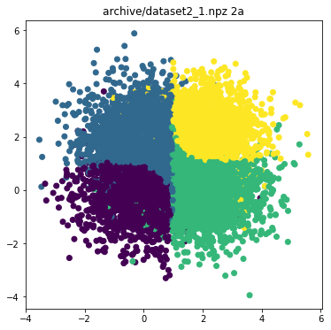{width="3.1181102362204722in"
height="3.106299212598425in"}

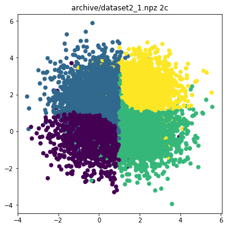{width="3.1181102362204722in"
height="3.106299212598425in"}

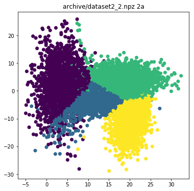{width="3.1692913385826773in"
height="3.106299212598425in"}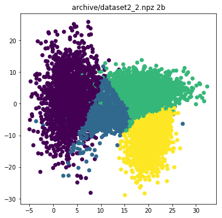{width="3.1692913385826773in"
height="3.106299212598425in"}

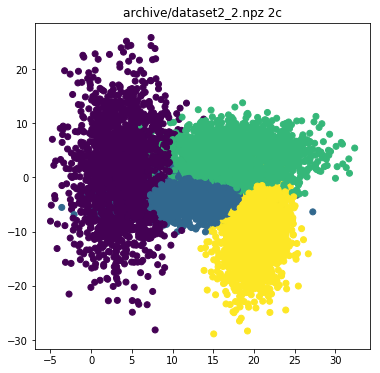{width="3.1692913385826773in"
height="3.106299212598425in"}

| Dataset  | 2a     | 2b      | 2c      |
|----------|--------|---------|---------|
| Dataset1 | 0.699  | 0.7     | 0.69975 |
| Dataset2 | 0.8545 | 0.83475 | 0.88575 |

For dataset 2, since the accuracy is higher in '2a' the probable
covariance matrix is nearer to $I$. Since the data is limited 2a wins
against the other two.

**Problem 3**:

| Size = 100   | 1                 | 2                 | 4                 | 8                 | 16               |
|--------------|-------------------|-------------------|-------------------|-------------------|------------------|
| $$10^{- 9}$$ | 0.191 0.005 0.031 | 0.187 0.004 0.03  | 0.127 0.01 0.007  | 0.034 0.001 0.0   | 0.191 0.036 0.0  |
| $$10^{- 7}$$ | 0.221 0.0 0.048   | 0.189 0.004 0.032 | 0.071 0.002 0.003 | 0.071 0.005 0.0   | 0.09 0.008 0.0   |
| $$10^{- 5}$$ | 0.221 0.001 0.048 | 0.208 0.003 0.04  | 0.076 0.002 0.003 | 0.028 0.001 0.0   | 0.135 0.018 0.0  |
| $$10^{- 3}$$ | 0.227 0.002 0.05  | 0.186 0.006 0.028 | 0.081 0.001 0.005 | 0.081 0.004 0.002 | 0.12 0.012 0.002 |
| $$10^{- 1}$$ | 0.236 0.002 0.055 | 0.205 0.001 0.04  | 0.22 0.004 0.037  | 0.174 0.002 0.025 | 0.145 0.002 0.02 |
| $$10$$       | 0.581 0.0 0.321   | 0.502 0.0 0.254   | 0.525 0.0 0.268   | 0.535 0.0 0.279   | 0.458 0.0 0.216  |

In the above table, each triplet is bias variance and mean square error
respectively.

In each row, as the degree of the polynomial increases,

Bias decreases

Variance increases

Error is negligible.

**Problem** 4:

Degree indicates the complexity of the algorithm i.e. more bias. We can
clearly see that error decreases as the degree increases. In all the
four tables. But that is not the case with the regularization parameter
$\lambda$.

As $\lambda$ increases it error first decreases and then increases. So,
there exists a $\lambda$ for which the error is minimum.

**With data size**

The error tends to a particular value when the data is sufficiently
large, it fluctuates a lot when the data is less.

| Size = 50    | 1           | 2       | 4       | 8           | 16          |
|--------------|-------------|---------|---------|-------------|-------------|
| $$10^{- 9}$$ | 0.034308002 | 0.03417 | 0.00285 | 1.17E-06    | 1.35E-07    |
| $$10^{- 7}$$ | 0.049850486 | 0.02523 | 0.00312 | 1.33E-05    | 8.97E-06    |
| $$10^{- 5}$$ | 0.060659655 | 0.03008 | 0.00372 | 0.000517901 | 0.00027122  |
| $$10^{- 3}$$ | 0.045261153 | 0.0349  | 0.00686 | 0.006244835 | 0.004446429 |
| $$10^{- 1}$$ | 0.071453352 | 0.05909 | 0.05764 | 0.044971997 | 0.045550811 |
| $$10$$       | 0.347887838 | 0.24483 | 0.2778  | 0.29677588  | 0.305173074 |

| Size = 100   | 1           | 2       | 4       | 8           | 16          |
|--------------|-------------|---------|---------|-------------|-------------|
| $$10^{- 9}$$ | 0.043695186 | 0.03013 | 0.00488 | 4.28E-05    | 5.62E-07    |
| $$10^{- 7}$$ | 0.052683909 | 0.03239 | 0.00525 | 4.40E-05    | 1.91E-05    |
| $$10^{- 5}$$ | 0.04939354  | 0.03268 | 0.0063  | 0.000448675 | 0.000340272 |
| $$10^{- 3}$$ | 0.051191627 | 0.03681 | 0.00677 | 0.006413914 | 0.005137977 |
| $$10^{- 1}$$ | 0.072557277 | 0.0531  | 0.04543 | 0.050109888 | 0.048204197 |
| $$10$$       | 0.273906519 | 0.32247 | 0.25835 | 0.248623267 | 0.294794864 |

| size = 200                     | 1           | 2       | 4       | 8           | 16          |
|--------------------------------|-------------|---------|---------|-------------|-------------|
| $$\mathbf{10}^{\mathbf{- 9}}$$ | 0.064464827 | 0.03368 | 0.00733 | 6.46E-05    | 9.95E-07    |
| $$\mathbf{10}^{\mathbf{- 7}}$$ | 0.057067492 | 0.0336  | 0.00589 | 0.000109199 | 2.11E-05    |
| $$\mathbf{10}^{\mathbf{- 5}}$$ | 0.053510286 | 0.0388  | 0.00539 | 0.000700482 | 0.000398855 |
| $$\mathbf{10}^{\mathbf{- 3}}$$ | 0.048100098 | 0.03233 | 0.0082  | 0.006584106 | 0.005232591 |
| $$\mathbf{10}^{\mathbf{- 1}}$$ | 0.060040998 | 0.06084 | 0.05412 | 0.051747374 | 0.051088836 |
| $$\mathbf{10}$$                | 0.282044352 | 0.28941 | 0.28625 | 0.289127174 | 0.251245462 |

| size = 1000                    | 1           | 2        | 4        | 8           | 16          |
|--------------------------------|-------------|----------|----------|-------------|-------------|
| $$\mathbf{10}^{\mathbf{- 9}}$$ | 0.05326708  | 0.033095 | 0.005806 | 0.000132004 | 1.63E-06    |
| $$\mathbf{10}^{\mathbf{- 7}}$$ | 0.054767608 | 0.034762 | 0.006184 | 0.000134224 | 2.72E-05    |
| $$\mathbf{10}^{\mathbf{- 5}}$$ | 0.052905331 | 0.033575 | 0.006218 | 0.000689306 | 0.000475332 |
| $$\mathbf{10}^{\mathbf{- 3}}$$ | 0.052758151 | 0.035832 | 0.00877  | 0.007078345 | 0.005751879 |
| $$\mathbf{10}^{\mathbf{- 1}}$$ | 0.071529684 | 0.05903  | 0.054853 | 0.05321911  | 0.050834193 |
| $$\mathbf{10}$$                | 0.288818618 | 0.286704 | 0.284781 | 0.279448036 | 0.283429484 |
